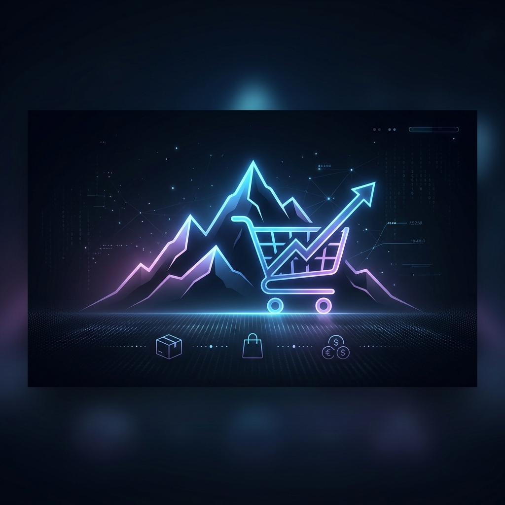

# 🏔️ MountEdge E-Commerce Platform

<p align="center">
  
</p>



## 🌟 Overview
**MountEdge** is a premium, professional-grade e-commerce ecosystem built for modern retail. It features a high-performance **Java Spring Boot** backend and a stunning **Vanilla HTML/CSS/JS** frontend. The platform is architected with strict adherence to **OOPS principles** and **DBMS best practices**, offering a scalable, secure, and feature-rich experience for both customers and administrators.

---

## 🚀 New & Advanced Features

### 📊 Admin Analytics & Insights
- **Interactive Dashboards**: Dynamic visualization of revenue trends, product performance, and user activity using **Chart.js**.
- **Real-time Stats**: Instant overview of total revenue, average order value, and stock levels.
- **Sales Breakdown**: Monthly and categorical analysis to drive business decisions.

### 📄 Professional Reporting System
- **Excel Export**: Generate comprehensive multi-sheet **.xlsx** reports using **Apache POI**.
- **Audit Trails**: Detailed logs of order status changes and administrative actions.
- **Executive Summaries**: High-level KPI reporting for stakeholders.

### 📦 Order & Logistics Management
- **Bulk Order Workflow**: Specialized system for large-scale orders with administrative approval/rejection cycles.
- **Scheduled Orders**: Automated processing for recurring or future-dated purchases.
- **Invoicing**: Automatic generation of professional, print-ready invoices for every transaction.
- **Order Tracking**: Real-time status updates from "Pending" to "Delivered".

### 🎨 Premium UI/UX
- **Glassmorphism Design**: Sleek, modern aesthetic with semi-transparent elements and vibrant gradients.
- **Responsive Layouts**: Optimized for seamless experiences across desktop, tablet, and mobile devices.
- **Interactive Components**: Micro-animations and smooth transitions for enhanced engagement.

### 🛡️ Enterprise-Grade Security
- **JWT Authentication**: Secure, stateless session management using JSON Web Tokens.
- **Role-Based Access (RBAC)**: Granular permissions for Users and Administrators.
- **Password Encryption**: Industry-standard hashing for user data protection.

---

## 🛠️ Tech Stack

<p align="left">
  
  
  
  
  
  
</p>

- **Backend**: Spring Boot 3.2.4 (REST API), Spring Security, Spring Data JPA.
- **Reporting**: Apache POI (Excel Generation).
- **Database**: MySQL 8.0 (Relational Mapping & Complex Joins).
- **Frontend**: HTML5, CSS3 (Glassmorphism, Dark Theme), Vanilla JavaScript (Fetch API, Chart.js).
- **Architecture**: Domain-Driven Design principles with Layered Architecture.

---

## 📁 Project Structure

```text
mountedge-e-commerce/
├── src/main/java/com/mountedge/ecommerce/
│   ├── config/      # Security, JWT & DB Initializers
│   ├── controller/  # REST Endpoints (Admin, Product, Order, etc.)
│   ├── dto/         # Data Transfer Objects for clean API contracts
│   ├── entity/      # JPA Entities (Database Schema Mapping)
│   ├── repository/  # Data Access Layer (Spring Data JPA)
│   ├── service/     # Business Logic (Analytics, Reports, Orders)
│   └── exception/   # Global Exception Handling
├── src/main/resources/
│   ├── static/      # Frontend Assets (HTML, CSS, JS, Images)
│   ├── schema.sql   # Database Initialization
│   └── application.properties # Server Configuration
├── assets/          # Project Documentation Media
└── pom.xml          # Maven Dependencies (Spring, POI, etc.)
```

---

## ⚙️ Setup & Installation

### 1. Database Configuration
1. Ensure MySQL is installed and running.
2. Create a database named `mountedge`.
3. Update `src/main/resources/application.properties` with your MySQL credentials:
   ```properties
   spring.datasource.username=YOUR_USERNAME
   spring.datasource.password=YOUR_PASSWORD
   ```

### 2. Build and Run
1. Clone the repository.
2. Navigate to the project root and run:
   ```bash
   mvn clean install
   mvn spring-boot:run
   ```
3. Access the application at: `http://localhost:8080`

---

## 🤝 Contribution
Contributions are welcome! Please fork the repository and submit a pull request.

## 📄 License
This project is licensed under the MIT License.

---
<p align="center">Built with 🏔️ by Shlok Shinde</p>

